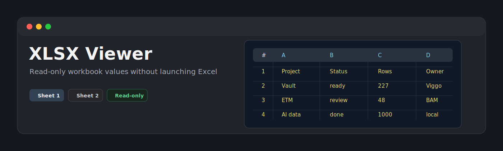
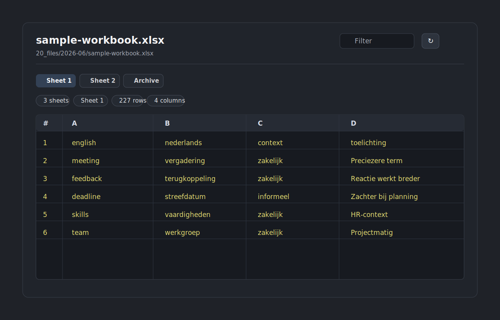

<p align="center">
  
</p>

<p align="center">
  <a href="LICENSE"></a>
  
  
  
</p>

# XLSX Viewer

XLSX Viewer is a small read-only plugin for opening `.xlsx` files as workbook tables without launching Excel. It is built for quick inspection of AI-generated spreadsheets, exports, and reference files inside a vault.



## Features

- Opens `.xlsx` files in a dedicated view.
- Shows one sheet at a time with sheet tabs.
- Displays cell values only.
- Shows cached/formatted formula values when they are present in the workbook.
- Does not evaluate formulas.
- Filters visible rows by searching across cells.
- Shows sticky column letters and row numbers.
- Displays workbook sheet count, active sheet, row count, column count, and render-cap status.
- Handles empty sheets and malformed workbook input with plain error states.
- Renders the first 10,000 rows to keep the view responsive.
- Stays read-only by design: it never writes back to workbook files.

## Scope

This is intentionally a v0.1 viewer, not a spreadsheet editor. It does not support editing, formatting, charts, merged-cell layout, formulas, pivot tables, comments, macros, or workbook protection. The goal is simple: open the file, show the values, and avoid leaving the vault for a quick look.

## Large files

Spreadsheet files can become large quickly. XLSX Viewer parses the workbook and renders the first 10,000 rows of the active sheet. Additional rows are counted and reported in the warning area.

## Privacy and security

XLSX Viewer does not make network requests and does not send vault content to external services. It does not use the system clipboard. It reads files through the vault API and renders a local view.

## Local installation

This repository is currently intended for personal/local use.

1. Run `npm install` and `npm run build`.
2. Create this folder in your vault: `.obsidian/plugins/xlsx-viewer/`.
3. Copy `main.js`, `manifest.json`, and `styles.css` into that folder.
4. Reload the app.
5. Enable **XLSX Viewer** in **Settings -> Community plugins**.

## Usage

Open any `.xlsx` file in your vault. The file opens with XLSX Viewer.

Use the toolbar to:

- filter visible rows
- switch sheets
- refresh the file after external changes

## Development

```bash
npm install
npm run build
npx tsc --noEmit
npm test
```

## Release checklist

If this plugin is later published publicly, use the same release shape as the other viewer plugins:

1. Update `manifest.json`, `package.json`, and `versions.json`.
2. Run `npm install`, `npm run build`, `npx tsc --noEmit`, and `npm test`.
3. Create a GitHub release whose tag exactly matches `manifest.json.version`.
4. Attach `main.js`, `manifest.json`, and `styles.css` as release assets.
5. Add artifact attestations if publishing through GitHub Actions.

## Parser dependency

XLSX Viewer uses [read-excel-file](https://gitlab.com/catamphetamine/read-excel-file) to read workbook data. The dependency is bundled into `main.js` at build time.

## License

[MIT](LICENSE)
